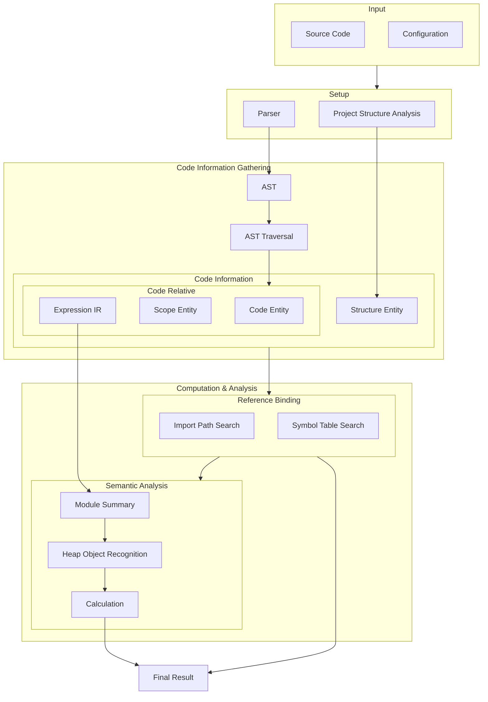

# Language Feature Profiling

> This package is not an ENRE functioning component, but a peripheral documentation
> package.

This package categorizes language features in JavaScript and TypeScript that have impacts
on the static analysis, and it also
provides [CodeFuse-Query](https://github.com/codefuse-ai/CodeFuse-Query) Godel query
scripts for performing statistic experiments (Some statistic metrics may require
additional processing other than Godel query).

Under the `src` directory, the first level directories are the `group` of language
features, and its sub-directories are each individual `feature`s. Each feature contains
a `README.md` file to describe its pattern and metrics that we interested in, and a
correlated Godel script.

## CodeFuse-Query Usage

1. Codebase -> COREF Database

```bash
$ sparrow database create --data-language-type=javascript -s <dirpath> -o <savedirname>
```

2. COREF Database -Godel Query Script-> JSON Result

```bash
$ sparrow query run --format json --database <dirpath> --gdl <filepath> --output <dirpath>
```

## Why these features?

Considering the following general static code analysis pipeline:



All features listed in this package can be attributed to one of the steps in the pipeline,
and fail to resolve them will hinder the accuracy of static code analysis.
