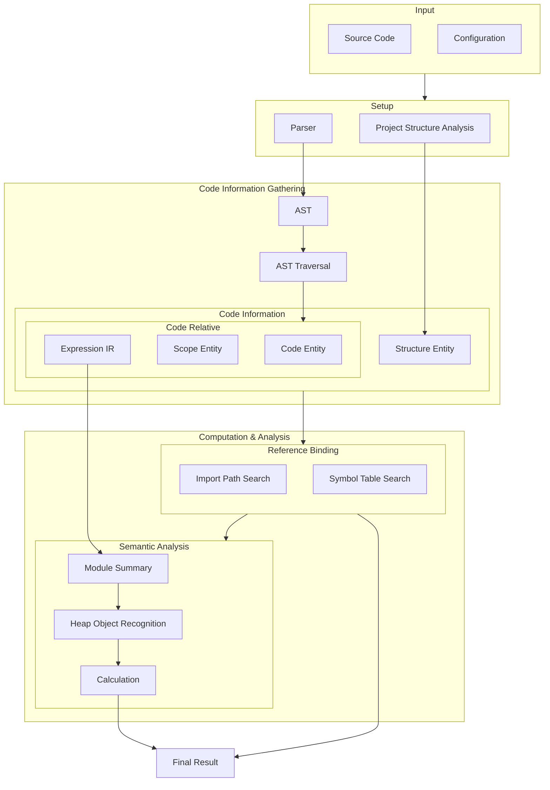

# Language Feature Profiling

> This package is not an ENRE functioning component, but a peripheral documentation
> package.

This package categorizes language features in JavaScript and TypeScript that have impacts
on the static analysis, and it also
provides [CodeFuse-Query](https://github.com/codefuse-ai/CodeFuse-Query) Godel query
scripts for performing statistic experiments (Some statistic metrics may require
additional processing other than Godel query).

Under the `src` directory, the first level directories are the `group` of language
features, and its sub-directories are each individual `feature`s. Each feature contains
a `README.md` file to describe its pattern and metrics that we interested in, and a
correlated Godel script.

If the Godel script name starts with `get`, then it is a functional script; whereas a
script whose name starts with `use` is only a placeholder, the real script when
working on this feature should be the script whose name starts with `get`, also the
trailing part should remain the same.

## CodeFuse-Query Usage

1. Codebase -> COREF Database

```bash
$ sparrow database create --data-language-type=javascript -s <dirpath> -o <savedirname>
```

2. COREF Database -Godel Query Script-> JSON Result

```bash
$ sparrow query run --format json --database <dirpath> --gdl <filepath> --output <dirpath>
```

### Memo

#### Load customized library

Set up the VS Code plugin, this only enables the VS Code plugin to not
produce `Module Not Found`.

```json5
{
    "godelScript.executablePath": "/abs/path/to/sparrow-cli/godel-script/usr/bin/godel",
    // The point is to use comma to separate multiple paths
    "godelScript.libraryDirectoryPath": "/abs/path/to/sparrow-cli/lib-1.0, /abs/path/to/your/lib",
}
```

~~In the command line usage, append `--package-path <path>` to the command.~~ Sparrow
2.0.2 does not support this cli option.

Workaround:

A. Create your new `gdl` file under `/lib-script/coref/javascript/`, and *
*rebuild lib** by `sparrow rebuild lib -lang javascript`.

(To use ENRE-ts predefined functions, Copy-paste `fixtures/_utils/Enrets.gdl` file.)

B. Manually form the final cli command to the godel runner.

#### Godel lang caveats

1. Schema's `__all__` method does not support more than 1 parameter, or
   an `NotImplemented` error would be thrown by `godel-ir2souffle`.
2. `output()` does not accept a function with bool parameter, so this has to be done in
   post-processing, to automate this, a field can be appended `_SB` indicating this field
   is a string boolean, and before JSON content is transfer to post-processing logic, the
   string will be converted to a boolean (or `undefined` if the string is `"-"`), and the
   postfix `_SB` will be removed.

#### Sparrow design philosophy

1. **Convention Over Configuration**: The COREF database model does not store the AST
   node's key, for example, an `Identifier` node of its parent `FunctionDeclaration.name`.
   All children nodes are stored in a fixed order (written in extractor where flatten the
   AST tree), so that a convention that (for example) index 0 will always be the name of
   its parent node can be made. However, there are cases that the children count is not
   fixed, a child at what index represents what can not be determined only by index, at
   which other tables will also be used to determine that, for example, the variadic
   parameters of a function declaration, a `Parameter` table exists for that purpose.

#### Godel query experiences

1. Make good use of 'bottom-up' method. When considering a pattern from top to down, and
   it is too complicated to write all rules in Godel, consider to write a bottom-up rule
   which starts by checking most basic node (e.g. Identifier), and make use of our lib
   method `getNodePath` to check all ancestor nodes. This method can make things much
   easier.

## Why these features?

Considering the following general static code analysis pipeline:



All features listed in this package can be attributed to one of the steps in the pipeline,
and fail to resolve them will hinder the accuracy of static code analysis.

Note that some normal and common language features are not listed here.

## Metric syntax

### #Usage, #Usage(feature)%(denominator1, denominator2, ...)

This metric produces a count number of the feature and several percentages where each
percentage is against a certain denominator.

### Type{type1, type2, ...}

This metric produces one of values that defined within the bracket, can be seen as an
enumerator.

Each option should be explained.

### MaxCount(description)

This metrics produces the max count number of the feature in a given context, for example,
the max depth, the max usage count under a class, etc.

### Decorators

Metrics can be appended with decorators to indicate additional information.

* `@LLMPowered`, it means that this metric requires
  interaction with the LLM.
* `@intent?`, it means that this metric requires further investigation to determine the
  reason to use this feature.

## Feature Tags

| Tag                      | Description                                                                                                      |
|--------------------------|------------------------------------------------------------------------------------------------------------------|
| **Feature Release Date** |                                                                                                                  |
| `stage-3`1               | The feature is in stage-3 of the TC39 proposal process.                                                          |
| `new`1                   | The feature is (relative) new in the language (unlike a `stage-3` feature, `new` feature is officially release). |
| **Analysis Types**       |                                                                                                                  |
| `static`                 | The feature is static determinable and related to JavaScript value scope.                                        |
| `dynamic`                | The feature requires analysis to narrow its dynamic behavior.                                                    |
| `typing`                 | The feature is static determinable and related to TypeScript type system.                                        |
| **Feature Behaviors**    |                                                                                                                  |               
| `implicit`               | The feature has implicit behavior. (E.g. implicit function call, etc.)                                           |
| `semantic`               | The feature is a high-level semantic feature, and may require semantic analysis to resolve.                      |

1. Can append `(ES2022)` or `(TS5.0)` or both with comma separation to indicate the
   language version that introduces
   this feature.
